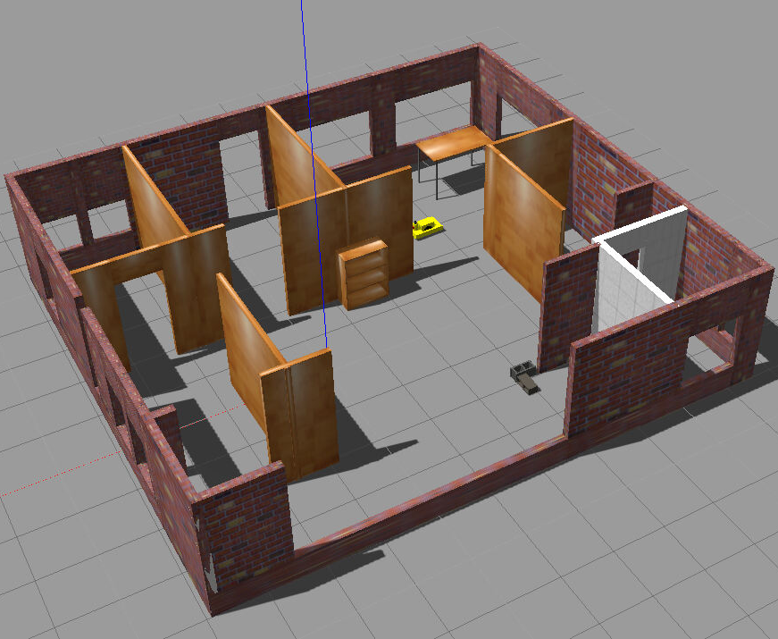
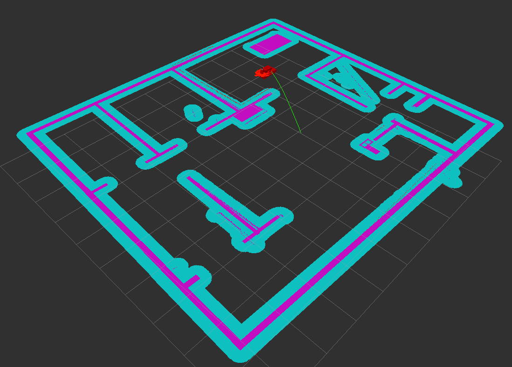

# The robot localization project

The project demonstrates a robot localization task (only by using a LIDAR sensor onboard own designed robot and in own designed environment map) by AMCL algorithm within the ROS libraries, visualization is done by Rviz, and simulation by the Gazebo framework.

## File structure

```bash
|-- CMakeLists.txt -> /opt/ros/kinetic/share/catkin/cmake/toplevel.cmake
|-- README.md
|-- images
|   |-- cost_map.png
|   `-- gazebo_map.png
|-- my_robot
|   |-- CMakeLists.txt
|   |-- config
|   |   |-- base_local_planner_params.yaml
|   |   |-- costmap_common_params.yaml
|   |   |-- global_costmap_params.yaml
|   |   |-- local_costmap_params.yaml
|   |   `-- rviz_config.rviz
|   |-- launch
|   |   |-- amcl.launch
|   |   |-- robot_description.launch
|   |   `-- world.launch
|   |-- maps
|   |   |-- my_map.pgm
|   |   `-- my_world.yaml
|   |-- meshes
|   |   `-- hokuyo.dae
|   |-- package.xml
|   |-- urdf
|   |   |-- my_robot3.gazebo
|   |   `-- my_robot3.xacro
|   `-- worlds
|       `-- empty.world
|-- pgm_map_creator
|   |-- CMakeLists.txt
|   |-- CODEOWNERS
|   |-- LICENSE
|   |-- README.md
|   |-- launch
|   |   `-- request_publisher.launch
|   |-- maps
|   |   `-- map.pgm
|   |-- msgs
|   |   |-- CMakeLists.txt
|   |   `-- collision_map_request.proto
|   |-- package.xml
|   |-- src
|   |   |-- collision_map_creator.cc
|   |   `-- request_publisher.cc
|   `-- world
|       |-- my_world.world
|       `-- udacity_mtv
`-- teleop_twist_keyboard
    |-- CHANGELOG.rst
    |-- CMakeLists.txt
    |-- README.md
    |-- package.xml
    `-- teleop_twist_keyboard.py
```

## Screenshots





## Parameters set

```bash
 * /amcl/base_frame_id: robot_footprint
 * /amcl/global_frame_id: map
 * /amcl/gui_publish_rate: -1
 * /amcl/initial_pose_a: 0
 * /amcl/initial_pose_x: 0
 * /amcl/initial_pose_y: 0
 * /amcl/kld_err: 0.05
 * /amcl/kld_z: 0.93
 * /amcl/laser_likelihood_max_dist: 8.0
 * /amcl/laser_max_beams: 30
 * /amcl/laser_max_range: -1
 * /amcl/laser_min_range: -1
 * /amcl/laser_model_name: likelihood_field
 * /amcl/lazer_sigma_hit: 0.05
 * /amcl/lazer_z_hit: 0.9
 * /amcl/lazer_z_rand: 0.02
 * /amcl/lazer_z_short: 0.1
 * /amcl/max_particles: 5000
 * /amcl/min_particles: 200
 * /amcl/odom_alpha1: 0.015
 * /amcl/odom_alpha2: 0.005
 * /amcl/odom_alpha3: 0.015
 * /amcl/odom_alpha4: 0.005
 * /amcl/odom_frame_id: odom
 * /amcl/odom_model_type: diff-corrected
 * /amcl/recovery_alpha_fast: 0.003
 * /amcl/recovery_alpha_slow: 0.05
 * /amcl/resample_interval: 2
 * /amcl/selective_resampling: True
 * /amcl/set_initial_pose: True
 * /amcl/tf_broadcast: True
 * /amcl/transofrm_tolerance: 0.05
 * /amcl/update_min_a: 0.52
 * /amcl/update_min_d: 0.2
 * /move_base/TrajectoryPlannerROS/acc_lim_theta: 3.2
 * /move_base/TrajectoryPlannerROS/acc_lim_x: 2.5
 * /move_base/TrajectoryPlannerROS/acc_lim_y: 2.5
 * /move_base/TrajectoryPlannerROS/gdist_scale: 0.8
 * /move_base/TrajectoryPlannerROS/holonomic_robot: False
 * /move_base/TrajectoryPlannerROS/max_vel_theta: 0.57
 * /move_base/TrajectoryPlannerROS/max_vel_x: 0.5
 * /move_base/TrajectoryPlannerROS/min_in_place_vel_theta: 0.314
 * /move_base/TrajectoryPlannerROS/min_vel_x: 0.1
 * /move_base/TrajectoryPlannerROS/occdist_scale: 0.001
 * /move_base/TrajectoryPlannerROS/pdist_scale: 0.6
 * /move_base/TrajectoryPlannerROS/sim_time: 1.0
 * /move_base/TrajectoryPlannerROS/vtheta_samples: 20.0
 * /move_base/TrajectoryPlannerROS/vx_samples: 3.0
 * /move_base/TrajectoryPlannerROS/vy_samples: 3.0
 * /move_base/base_global_planner: navfn/NavfnROS
 * /move_base/base_local_planner: base_local_planne...
 * /move_base/controller_frequency: 4
 * /move_base/global_costmap/cost_scaling_factor: 5
 * /move_base/global_costmap/global_frame: map
 * /move_base/global_costmap/height: 16.0
 * /move_base/global_costmap/inflation_radius: 0.25
 * /move_base/global_costmap/inflation_unknown: True
 * /move_base/global_costmap/laser_scan_sensor/clearing: True
 * /move_base/global_costmap/laser_scan_sensor/data_type: LaserScan
 * /move_base/global_costmap/laser_scan_sensor/marking: True
 * /move_base/global_costmap/laser_scan_sensor/sensor_frame: hokuyo
 * /move_base/global_costmap/laser_scan_sensor/topic: scan
 * /move_base/global_costmap/map_type: costmap
 * /move_base/global_costmap/observation_sources: laser_scan_sensor
 * /move_base/global_costmap/obstacle_range: 4.0
 * /move_base/global_costmap/publish_frequency: 3.0
 * /move_base/global_costmap/raytrace_range: 8.0
 * /move_base/global_costmap/resolution: 0.02
 * /move_base/global_costmap/robot_base_frame: robot_footprint
 * /move_base/global_costmap/robot_radius: 0.4
 * /move_base/global_costmap/rolling_window: False
 * /move_base/global_costmap/static_map: True
 * /move_base/global_costmap/transform_tolerance: 0.2
 * /move_base/global_costmap/update_frequency: 3.0
 * /move_base/global_costmap/width: 16.0
 * /move_base/local_costmap/cost_scaling_factor: 5
 * /move_base/local_costmap/global_frame: odom
 * /move_base/local_costmap/height: 10.0
 * /move_base/local_costmap/inflation_radius: 0.25
 * /move_base/local_costmap/inflation_unknown: True
 * /move_base/local_costmap/laser_scan_sensor/clearing: True
 * /move_base/local_costmap/laser_scan_sensor/data_type: LaserScan
 * /move_base/local_costmap/laser_scan_sensor/marking: True
 * /move_base/local_costmap/laser_scan_sensor/sensor_frame: hokuyo
 * /move_base/local_costmap/laser_scan_sensor/topic: scan
 * /move_base/local_costmap/map_type: costmap
 * /move_base/local_costmap/observation_sources: laser_scan_sensor
 * /move_base/local_costmap/obstacle_range: 4.0
 * /move_base/local_costmap/publish_frequency: 9.0
 * /move_base/local_costmap/raytrace_range: 8.0
 * /move_base/local_costmap/resolution: 0.02
 * /move_base/local_costmap/robot_base_frame: robot_footprint
 * /move_base/local_costmap/robot_radius: 0.4
 * /move_base/local_costmap/rolling_window: True
 * /move_base/local_costmap/static_map: False
 * /move_base/local_costmap/transform_tolerance: 0.2
 * /move_base/local_costmap/update_frequency: 9.0
 * /move_base/local_costmap/width: 10.0
 * /rosdistro: kinetic
 * /rosversion: 1.12.14
```